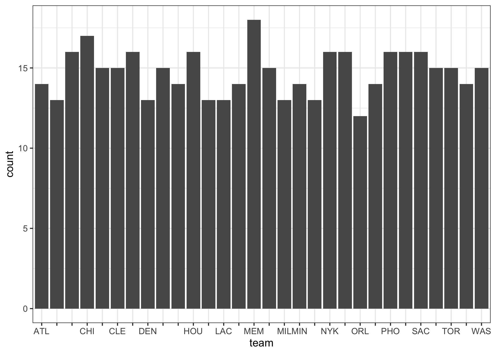
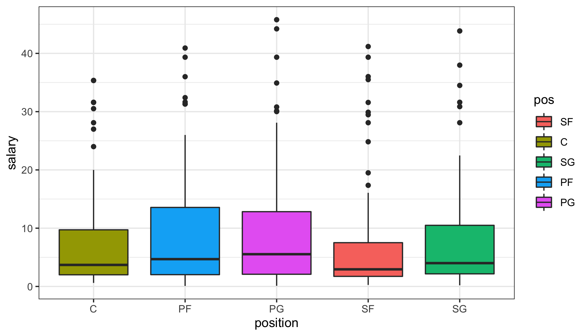
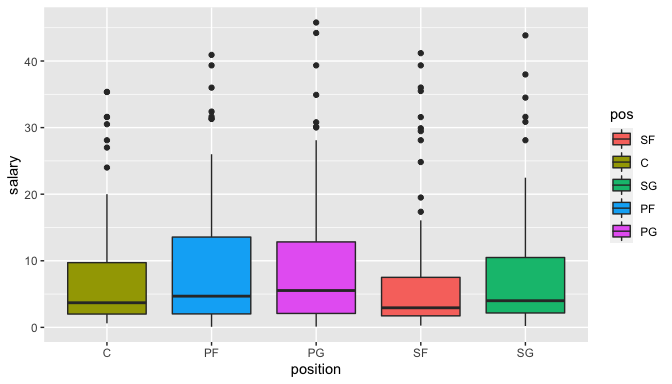
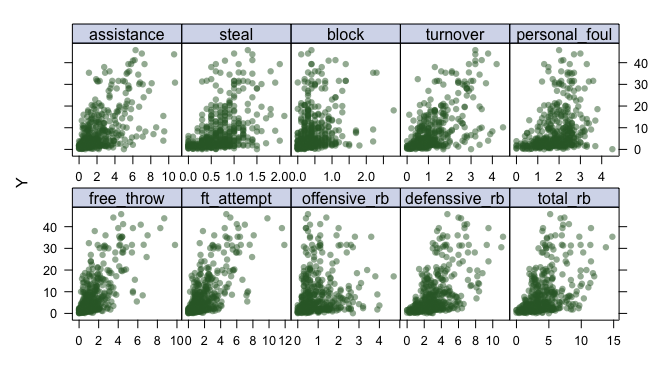
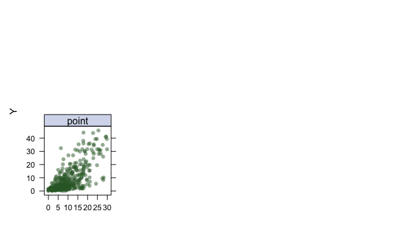

code
================
DS2
5/6/2022

## Introduction

NBA players are considered to be among the highest-paid athletes in the
world. Despite even the minimum wage in the NBA is way higher than that
of any professional league in North America, there’s a large gap between
NBA stars and ordinary players\[1\]. In this project, we are interested
in finding the factors that influence salary of NBA players. We will
also develop a model to predict the salary.

We will conduct data analysis and model construction based on two
datasets on NBA players’ contracted salary \[2\] and performance
statistics per game \[3\] in 2021-2022. The following steps are included
in our data preperation:

-   Two original datasets are inner joined by players and teams
-   Keep only one record with most number of games played for each of
    players, given a player may transfer to other teams during the
    session and have multiple records.
-   Remove 5 variables with missing values caused by division of other
    existing variables.

The final cleaned dataset has 442 records and 24 variables.

### Univariate analysis

The following plots show distribution of each univariable. For
categorical variables `team` and `pos`, they are dsitributed quite
evenly. There are 30 unique values in `team` and 5 in `pos`. We may
consider remove `team` for it may result in too many dummy variables in
the model.

<!-- -->

For numeric variables, some of them (`gs`, `ft`, `orb`,`blk`), including
response `salary` are skewed, with some players have extremely high
salary. Visualization for all variables are enclosed in Appendix B

<!-- -->

### Appendix B - Variable Distribution

<!-- -->

<!-- -->

<!-- -->

<!-- -->

### Correlation Analysis

<!-- -->

### Analyzing trends in data

From numeric variables, we found that `stl`,`x3p`, `age`,`gs` seem to
have some non-linear trends.

<!-- --><!-- --><!-- -->

From categorical variable `position`, extremely high values in salary
show in all positions and some teams.

<!-- -->
