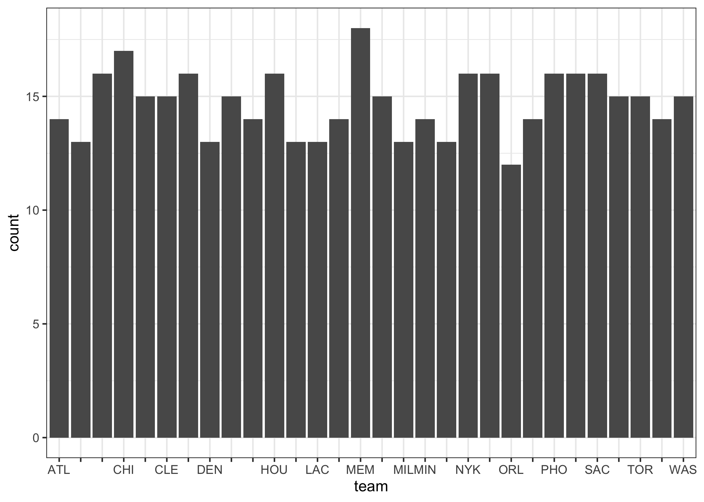
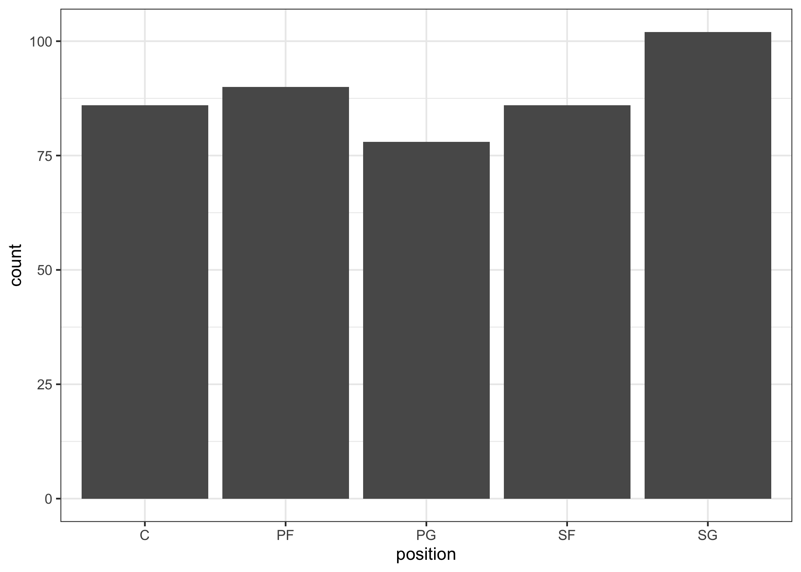
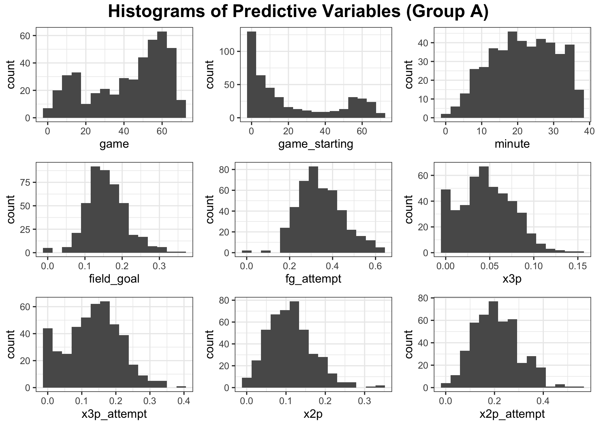
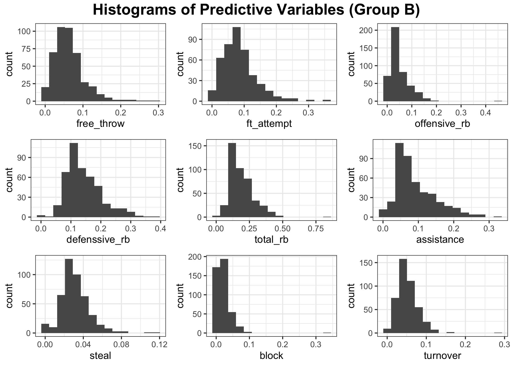
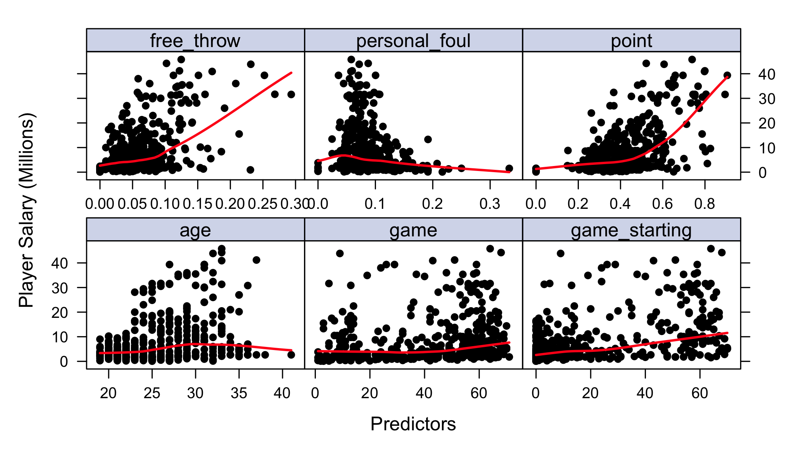
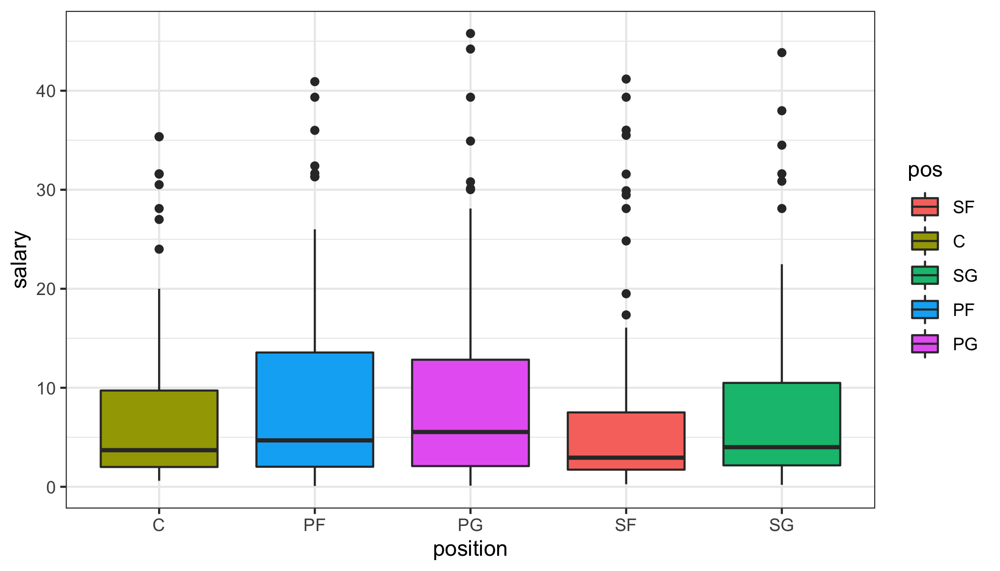
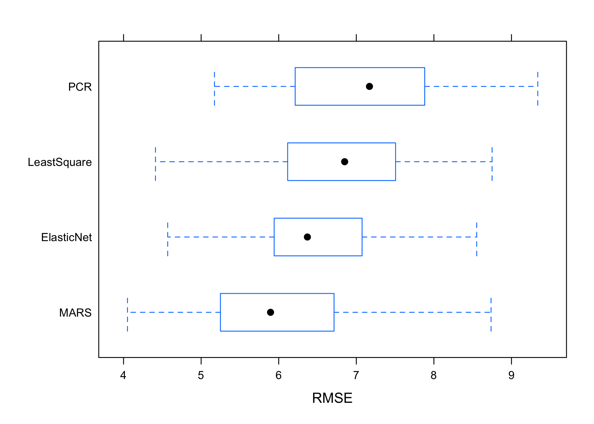

p8106 - Final Project - NBA Players Salary Prediction
================
Mingkuan Xu, Mengfan Luo, Yiqun Jin
5/6/2022

# Introduction

Describe your data set. Provide proper motivation for your work.

What questions are you trying to answer? How did you prepare and clean
the data?

## Data Preprocessing

## Part 0 - Data Preprocessing

## Part 1 - Exploratory Analysis

Since `minute` stands for minutes played per game, we will divided
variables stands for counts by `minute` to get a rate. These variables
includes `field_goal`, `fg_attempt` `x3p`, `x3p_attempt`, `x2p`,
`x2p_attempt`, `free_throw`, `ft_attempt`, `offensive_rb`
`defenssive_rb`, `total_rb`, `assistance`,`steal`, `block`, `turnover`,
`personal_foul` and `point`.

### Univariate Analysis

Distributions of the two categorical variables, `team` and `position`.

<!-- --><!-- -->

Distributions of other numeric variables.

<!-- --><!-- --><!-- -->

### Correlation Analysis

<!-- -->

### Analyzing trends in data

From numeric variables, we found that `stl`,`x3p`, `age`,`gs` seem to
have some non-linear trends.

<!-- --><!-- -->

From categorical variable `position`, extremely high values in salary
show in all positions and some teams.

<!-- -->

# Models

## Data Partition

After getting an overview of data from exploratory analysis, we splitted
the dataset into training (75%) and testing (20%). We would use 10 fold
repeated cross validation to compare each model using training data and
then select a best model to predict on testing data. Based on the
exploratory analysis, we would build 8 models in four category: 1.
Linear Regression: (1) simple Linear Regression Model, (2) Elastic-net
Model, (3) Principal Component Regression Model (PCR) 2. Generalized
Linear Regression: (4) Generalized Addictive Model (GAM), (5)
Multivariate Adaptive Regression Splines Model (MARS) 3. Tree based
Models Models: (6) Random Forest, (7) Generalized Boosted Regression
Modeling (GBM) 4. Blackbox Model (8) neural network

## Part 1 Linear regression

### (a) Standard Least-Squared

There is no tuning parameter for standard least-squared model.

    ## [1] 52.62129

### (b) Elastic Net

The elastic-net model has two parameter, which are alpha (compromise
between LASSO and ridge) and lambda (the penalty term limits the number
or magnitude of predictor coefficients). The elastic-net model reached
its best tune at *α* = 1 (i.e. LASSO model) and lambda = 0.27.

    ## [1] 0.2717072

<!-- -->

\#\#\#(c) Principle Component Regression

The tuning parameter of PCR is the number of predictors included in the
final model. There are 5 components included in the model with minimum
RMSE.

<!-- -->

## Part 2 Generalized Linear Regression

### (a) GAM

There is no tuning parameter for GAM. The GAM model can capture the
non-linear trend in the model, but it may have a high variance. `age`,
`game_starting`, `assistance`, `personal_foul`, and `point` are
statistically significant predictors at 0.0001 significant level.

    ## 
    ## Family: gaussian 
    ## Link function: identity 
    ## 
    ## Formula:
    ## salary ~ s(age) + s(game) + s(game_starting) + s(free_throw) + 
    ##     s(ft_attempt) + s(defenssive_rb) + s(assistance) + s(block) + 
    ##     s(personal_foul) + s(point)
    ## 
    ## Parametric coefficients:
    ##             Estimate Std. Error t value Pr(>|t|)    
    ## (Intercept)    8.151      0.301   27.08   <2e-16 ***
    ## ---
    ## Signif. codes:  0 '***' 0.001 '**' 0.01 '*' 0.05 '.' 0.1 ' ' 1
    ## 
    ## Approximate significance of smooth terms:
    ##                    edf Ref.df      F  p-value    
    ## s(age)           4.722  5.775 14.002  < 2e-16 ***
    ## s(game)          1.000  1.000  4.324 0.038422 *  
    ## s(game_starting) 1.532  1.883 23.181  < 2e-16 ***
    ## s(free_throw)    7.542  8.452  2.095 0.022370 *  
    ## s(ft_attempt)    2.098  2.759  0.603 0.485917    
    ## s(defenssive_rb) 1.330  1.585  2.465 0.065744 .  
    ## s(assistance)    1.114  1.217 17.575 2.90e-05 ***
    ## s(block)         1.000  1.000  0.009 0.923298    
    ## s(personal_foul) 7.693  8.529  3.699 0.000214 ***
    ## s(point)         3.351  4.242  6.044 7.88e-05 ***
    ## ---
    ## Signif. codes:  0 '***' 0.001 '**' 0.01 '*' 0.05 '.' 0.1 ' ' 1
    ## 
    ## R-sq.(adj) =  0.652   Deviance explained = 68.5%
    ## GCV = 33.514  Scale est. = 30.265    n = 334

    ## [1] 51.72913

### (b) MARS

The tuning parameter for MARS is `nprune` and `degree`. When attempting
to fit the MARS model, we noticed that the RMSE increased drastically
when degree is over 3 and nprune is over 8. Therefore, we would choose
the range of degrees as 1:3 and range of nprune as 2:8. When number of
terms is 6 and product degree is 2, MARS model reached its best tune and
RMSE is lowest. The MARS model selected 6 of 69 terms, and 6 of 54
predictors. And the top 3 important predictors are: `age`, `minute`,
`game`. MARS model is highly adaptive comparing with previous models and
has a higher prediction accuracy.

    ##    nprune degree
    ## 12      6      2

    ## Call: earth(x=matrix[334,54], y=c(3.98,3.63,2,9...), keepxy=TRUE, degree=2,
    ##             nprune=6)
    ## 
    ##                                      coefficients
    ## (Intercept)                               4.00399
    ## h(minute-28.7)                            0.80909
    ## teamWAS * h(free_throw-0.0879121)       146.14964
    ## teamCLE * h(free_throw-0.0879121)       803.51599
    ## h(age-22) * h(minute-22.8)                0.17834
    ## h(game-30) * h(free_throw-0.0879121)      4.82540
    ## 
    ## Selected 6 of 69 terms, and 6 of 54 predictors (nprune=6)
    ## Termination condition: RSq changed by less than 0.001 at 69 terms
    ## Importance: age, minute, game, free_throw, teamWAS, teamCLE, ...
    ## Number of terms at each degree of interaction: 1 1 4
    ## GCV 27.39806    RSS 8426.154    GRSq 0.6863058    RSq 0.7094144

<!-- -->

    ## [1] 40.30051

## Model Comparison

The CV RMSE are shown as followed. We can see MARS model has lowest
RMSE.

|             | Min. | 1st Qu. | Median | Mean | 3rd Qu. | Max. | NA’s |
|:------------|-----:|--------:|-------:|-----:|--------:|-----:|-----:|
| LeastSquare | 4.92 |    5.92 |   6.41 | 6.44 |    6.89 | 9.04 |    0 |
| ElasticNet  | 4.36 |    5.44 |   5.88 | 6.02 |    6.59 | 8.22 |    0 |
| PCR         | 4.07 |    6.10 |   6.78 | 6.70 |    7.41 | 8.80 |    0 |
| MARS        | 4.04 |    5.38 |   5.82 | 5.84 |    6.45 | 8.25 |    0 |

RMSE of Different Models

<!-- -->

|      | Linear | ElasticNet | PCR  | GAM  | MARS |
|:-----|:-------|:-----------|:-----|:-----|:-----|
| RMSE | 7.25   | 7.21       | 7.34 | 7.19 | 6.35 |

RMSE of Different Models on Test Set
