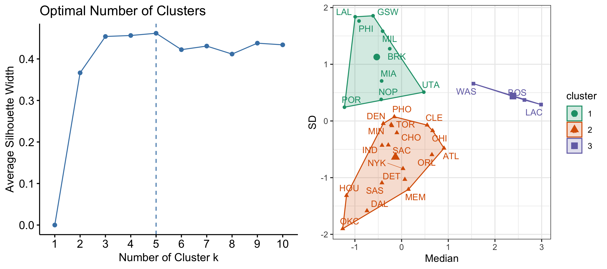
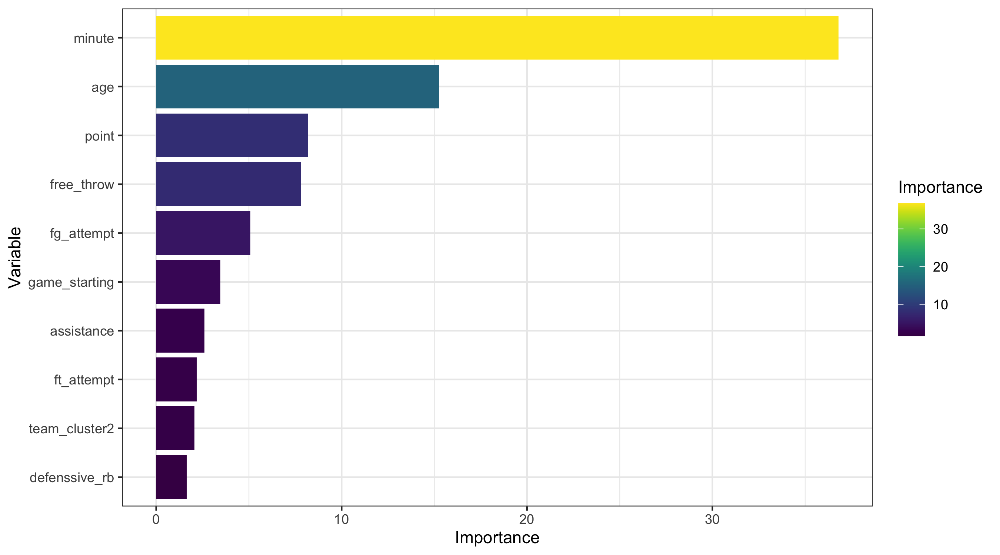
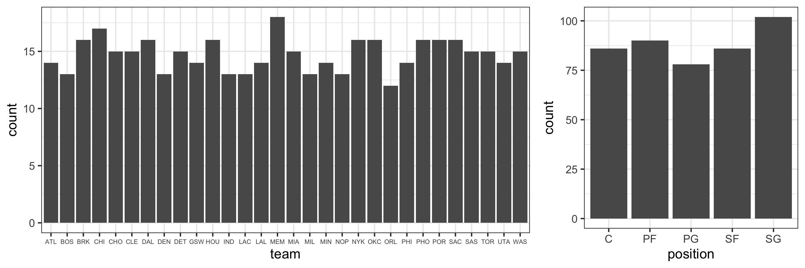
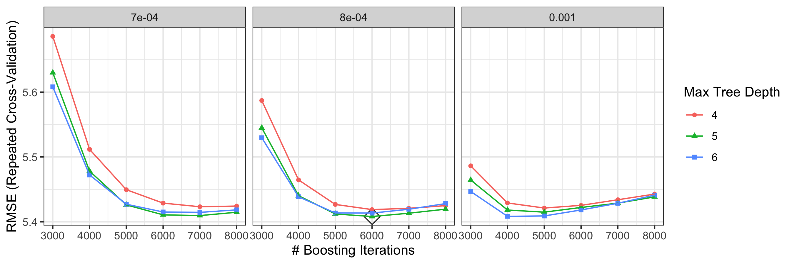

P8106 - Final Project - NBA Players Salary Prediction
================
Mingkuan Xu (mx2262), Mengfan Luo (ml4701), Yiqun Jin (yj2686)
05/11/2022

## Introduction

For teams in the National Basketball Association (NBA), a key strategy
to win more games is to properly allocate their salary cap - an
agreement that places a limit on the amount of money that a team can
spend on players’ salaries. How to evaluate the performance of each NBA
player and give a suitable level of salary is a complicated problem. In
this project, we intend to predict the salary of NBA players in the
2021-2022 season based on their game statistics. We collected game
statistics that are commonly used to evaluate players from the NBA
official website, built linear, generalized linear, tree-based, and
neural network, and conducted model comparison to determine a final
predictive model.

## Data Preprocessing

The data used for exploratory analysis and model construction are based
on two datasets: the NBA players’ contracted salary dataset \[1\] and
game performance statistics dataset \[2\] in 2021-2022. The data were
preprocessed using the following pipeline:

-   Two original datasets were inner joined by players and teams
-   Kept only one record with most number of games played for each of
    players, given a player may transfer to other teams during the
    session and have multiple records.
-   Removed 5 variables with missing values caused by division of other
    existing variables.
-   Divided count variables (`field_goal`, `free_throw`, etc.) by
    variable `minute` to convert them to efficiency.

The final cleaned dataset contained 442 records and 24 variables,
including 2 categorical variables, 21 numerical variables and 1 numeric
response variable `salary` (Table 1).

| Variable Name | Meaning                                    | Variable Type            |
|:--------------|:-------------------------------------------|:-------------------------|
| position      | Position of the player                     | categorical (5 classes)  |
| age           | Player’s age on February 1 of the season   | numeric                  |
| team          | Team that the player belong to             | categorical (30 classes) |
| game          | Number of games played                     | numeric                  |
| game_starting | Number of games played as a starter        | numeric                  |
| minute        | Minutes played per game                    | numeric                  |
| field_goal    | Field goals per minute                     | numeric                  |
| fg_attempt    | Field goal attempts per minute             | numeric                  |
| x3p           | 3-point field goals per minute             | numeric                  |
| x3p_attempt   | 3-point field goal attempts per minute     | numeric                  |
| x2p           | 2-point field goals per minute             | numeric                  |
| x2p_attempt   | 2-point field goal attempts per minute     | numeric                  |
| free_throw    | Free throws per minute                     | numeric                  |
| ft_attempt    | Free throw attempts per minute             | numeric                  |
| offensive_rb  | Offensive rebounds per minute              | numeric                  |
| defenssive_rb | Defensive rebounds per minute              | numeric                  |
| total_rb      | Total rebounds per minute                  | numeric                  |
| assistance    | Assists per minute                         | numeric                  |
| steal         | Steals per minute                          | numeric                  |
| block         | Blocks per minute                          | numeric                  |
| turnover      | Turnovers per minute                       | numeric                  |
| personal_foul | Personal fouls per minute                  | numeric                  |
| point         | Points per minute                          | numeric                  |
| salary        | Salary of the player in million (Response) | numeric                  |

Table of Variables

## Exploratory Analysis

### Univariate Analysis

The distribution of each variable in the dataset was plotted and
examined (Appendix A Figure 6&7). Categorical variables `team` and
`position` were distributed quite evenly (Appendix A Figure 7). While 30
unique values in `team` might lead to too many dummy variables in the
model, the variable was considered to be excluded or clustered into
fewer classes for model fitting. For numeric variables, some of them
(`game_starting`, `free_throw`, `offenssive_rb`,`block`), including
response `salary` are skewed, with some players have extremely high
salary.

### Correlation Analysis

From the correlation heatmap (Figure 1A), some variables were found to
be strongly correlated with others, leading to a potential problem of
multicolinearity. Such problem could be handled by using penalized
models (such as ridge/lasso regression and elastic-net) or ensembled
models (such as random forest, boosting, and neural network). From the
feature maps (Appendix A Figure 8), some predictive variables were found
to have non-linear correlations with `salary`, such as `age`, `game`,
`game_starting`, `free_throw`, `personal_foul` and `point` (Figure 1B).
Generalized linear regression models and other non-linear models,
including GAM, MARS, random forest and neural network model, could be
used to capture such non-linearity.

## Feature Engineering

To condense the 30-class categorical variable `team` into fewer dummy
variables, we tried clustering `team` into fewer classes based on the
median and standard deviation of player’s salary in each team. The
number of clusters

was chosen based on average silhouette width (Figure 2A). The resulting
clusters of `team` were shown in Figure 2B and stored in a new
variable`team_cluster`. Three clusters of teams are as below:

-   Cluster 1: `BRK`, `GSW`, `LAL`, `MIA`, `MIL`, `NOP`, `PHI`, `POR`,
    `UTA`
-   Cluster 2: `ATL`, `CHI`, `CHO`, `CLE`, `DAL`, `DEN`, `DET`, `HOU`,
    `IND`, `MEM`, `MIN`, `NYK`, `OKC`, `ORL`, `PHO`, `SAC`, `SAS`, `TOR`
-   Cluster 3: `BOS`, `LAC`, `WAS`

In the tree-based models, the replacement of `team` with `team_cluster`
led to a higher prediction accuracy. For other models, the variable
`team` was still used for model construction.

## Model Construction

After having an overview of the data, we splitted the dataset into
training (80%) and test (20%) set, used 10-fold repeated cross
validation to compare each model using training data, and evaluated the
model performances based on test error. We built 8 types of models in
four categories:

1.  Linear Regression Models: Standard Linear Regression Model, Elastic
    Net Model, Principal Component Regression Model (PCR)

2.  Generalized Linear Regression: Generalized Addictive Model (GAM),
    Multivariate Adaptive Regression Splines Model (MARS)

3.  Tree based Models Models: Random Forest (RF), Generalized Boosted
    Regression Modeling (GBM)

4.  Neural Network

### Part A - Linear Regression Models

#### (1) Standard Least-Squared

Standard Least-Squared model is used for a reference of other models, as
it may not perform well given the presence of multicolinearity and
nonliner trend in the data. There is no tuning parameter for standard
least-squared model.

#### (2) Elastic Net

The elastic-net model has two parameters, which are

(compromise between LASSO and ridge) and

(the penalty term limits the number or magnitude of predictor
coefficients). The elastic-net model reached its best tune at

and

(see Appendix B Figure 9A).

#### (3) Principle Component Regression

The tuning parameter of PCR is the number of principal components (PCs)
included in the final model. There are 12 PCs included in the model with
minimum RMSE (see Appendix B Figure 9B).

### Part B - Generalized Linear Regression Models

#### (4) GAM

There is no tuning parameter for GAM. The GAM model can capture the
non-linear trend in the model, but it may have a high variance. `age`,
`game_starting`, `assistance`, `personal_foul`, and `point` are
statistically significant predictors at 0.0001 significant level.

#### (5) MARS

The tuning parameters for MARS are `nprune` and `degree`. When
attempting to fit the MARS model, we noticed that the RMSE increased
drastically when degree was over 3 and nprune was over 8. Therefore, we
chose the range of degrees as 1:4 and range of `nprune`s as 2:8. When
`nprune = 6` and `degree = 3`, MARS model reached its best tune and RMSE
was the lowest. 6 of 54 predictors were included in the model, and the
top 3 important predictors were: `age`, `minute`, `game`. MARS model is
highly adaptive comparing with previous models and has a higher
prediction accuracy (see Appendix B Figure 9C).

### Part C: Tree-Based Models

#### (6) Random Forest

Tuning parameter for random forest regression in package `ranger` are
`mtry` (number of variables to split at in each node) and
`min.node.size` (minimal size of each node). Through 10-fold repeated CV
(see Appendix C Figure 12), the optimal random forest model had
parameters `mtry = 26` and `min.node.size = 1`. Random forest preserves
the advantage of single decision trees that can handle correlation
between variables and non-linearity. However, since here `mtry = 26`
equals our total number of variables, thus the random forest estimator
may not well decorrelate single trees, and thus may overfit the dataset.

#### (7) Generalized Boosted Regression Modeling (GBM)

Tuning parameters for Generalized boosted regression modeling (GBM) are
`n.trees` (total number of trees to fit), `interaction.depth` (maximum
depth of each tree), `shrinkage` (learning rate), and `n.minobsinnode`
(minimum number of observations in the terminal nodes). Through 10-fold
repeated CV (see Appendix C Figure 13), the optimal random forest model
had parameters `n.trees = 6000`, `interaction.depth = 5`,
`shrinkage = 0.0008`, and `n.minobsinnode = 1`.

### Part D: Neural Network

Several 2-hidden layer neural networks were built to fit the data. The
optimal model fitted after parameter tuning is a 2-hidden layer neural
network with

and

nodes in the first and second layers (Figure 3A), applying dropout
regularization. Figure 3B shows the resulting MSE in the training and
validation sets after 250 epochs.

As shown in Figure 3C, as the number of nodes in the first and second
hidden layers increases, neural networks can provide very accurate
fittings of the training data, with much lower MSEs compared to other
methods. However, the predictions are not satisfying when the models are
applying to the test data.

Despite trying different number of nodes and applying regularization
techniques (L2 and dropout), the resulting models still have a
noticeable overfitting problem. Given the size of the dataset is very
small
(),
the performance of neural network is not as good as some traditional
statistical models. It is more useful when the size of dataset is much
larger with more variables.

## Model Comparasion and Final Model Interpretation

### Model Comparison

The 10-fold CV RMSE (validation set RMSE for neural network) and test
set RMSE for all candidate models are shown in Table 2. The GBM has the
best performance in terms of CV RMSE.

|           | Linear | ElasticNet | PCR  | GAM  | MARS | RandomForest | GBM  | NeuralNetwork |
|:----------|:-------|:-----------|:-----|:-----|:-----|:-------------|:-----|:--------------|
| CV RMSE   | 6.79   | 6.45       | 7.16 | 6.84 | 6.06 | 5.42         | 5.41 | 6.40          |
| Test RMSE | 6.66   | 6.04       | 5.39 | 6.84 | 5.16 | 4.83         | 4.75 | 6.64          |

Summary of Model Performance

### Final Model Interpretation

Based on the CV RMSE and validation set RMSE, our best model is the GBM
with tuning parameters:

-   `n.trees = 6000`

-   `interaction.depth = 5`

-   `shrinkage = 0.0008`:

-   `n.minobsinnode = 1`

10 most important variables (computed from permuting OOB data) are
`minute`, `age`, `point`, `free_throw`, `fg_attempt`, `game_starting`,
`assistance`, `ft_attempt`, `team_cluster`, and `defensive_rb` (Figure
4).

With our fitted GBM model, we can make predictions on new observations.
The RMSE on our test data is 4.745948, which is the best among all the 8
models.

Given that GBM is a black-box model, we refer to the `lime` package to
explain the predictions of the model on new observations, by fitting a
simpler model to the permuted data with the above 10 most important
features. Table 3 displays 6 randomly selected observations from the
test data. The players’ name, true salary (in millions), and predicted
salary from GBM are shown.

| player           | salary (true) | salary (predicted by GBM) |
|:-----------------|--------------:|--------------------------:|
| Cade Cunningham  |     10.050120 |                  8.590867 |
| Cam Reddish      |      4.670160 |                  3.627087 |
| Christian Wood   |     13.666667 |                 14.730414 |
| Corey Kispert    |      3.383640 |                  3.248053 |
| D’Angelo Russell |     30.013500 |                 14.735256 |
| Danuel House Jr. |      2.045094 |                  4.792719 |

Prediction on Randomly Selected New Observations

The explanation of the GBM model from `lime` are shown in Figure 5.
Inside the plot, the x-axis shows the relative strength of each
variable, and positive values (blue) show that the the variable
increases the value of the prediction, while the negative values (red)
decrease the prediction value.

<figure>
<figcaption aria-hidden="true">Explanation of final GBM model from lime package</figcaption>
</figure>

Take the first case of player Cade Cunningham as an example. Cade’s true
salary is 10.050120 millions. His predicted salary from GBM is 8.590868
millions, which are quite similar to each other. Among the 10 most
important variables, factors `mintue > 90`, `point > 0.5`,
`game_starting > 43.8`, `assistance > 0.1241`, `fg_attempt > 0.401` and
`x2p_attempt > 0.269` increase Cade’s salary, while factors `age <= 23`,
`turnover > 0.065`, `0.057 < free_throw <= 0.082` and `team_cluster = 2`
decrease his salary.

## Conclusion

In this project, we explored different ways of building statistical
models to predict the salary of NBA players based on their game
statistics. We preprocessed the original raw data by removing missing
values, joining datasets, and deriving more meaningful variables based
on the existing ones. We then conducted an exploratory analysis to
detect useful patterns in variable distribution and their correlations.
To deal with the problems emerging from the preliminary analysis, such
as co-linearity, non-linearity, and a large number of dummy variables,
we did feature engineering to collapse categories, conducted variable
selection to reduce model dimensions, applied various regularization
techniques to prevent model overfitting, and introduced more
sophisticated statistical methods to capture non-linear relationships.
Among the 8 models fitted, we selected the GBM as the final predictive
model after evaluating their performances on cross validation RMSE.
Applying the final model on the test set, it also achieved a small RMSE
value, indicating an excellent prediction accuracy and a low level of
over-fitting. Other models did not achieve the same level of prediction
accuracy as the GBM, either underfitting the data with higher CV RMSE or
fitting the training data too well (particularly, in the case of the
neural network model).

From the GBM model, we also gained insights into important variables
that influence the player’s salary, among which the top 10 variables are
`minute`, `age`, `point`, `free_throw`, `fg_attempt`, `game_starting`,
`assistance`, `ft_attempt`, `team_cluster`, and `defensive_rb`. These
findings are consistent with our understanding of factors that commonly
affect the income of NBA players.

The study has several limitations. Interaction analysis can be conducted
in the family of linear regression models. In building the neural
network, we only trained the multilayer perceptron model with the ReLU
activation functions. Several other model structures and activation
functions are worth trying in the future. The model accuracy can be
further improved by introducing new variables. For example, the current
salary level of a player should be more related to his performance in
the year before making a new contract. Therefore, apart from the
statistics for the 2021-2022 season, player data from previous seasons
can also be included in the analysis. Furthermore, some players having a
high salary may suffer injuries in recent games; injury data can also be
taken into account.

## References

\[1\]<https://www.basketball-reference.com/contracts/players.html>

\[2\]<https://www.basketball-reference.com/leagues/NBA_2022_per_game.html>

\[3\]<https://www.geeksforgeeks.org/how-neural-networks-are-used-for-regression-in-r-programming/>

## Appendices

### Appendix A - Numeric Variable Distribution

<figure>
<figcaption aria-hidden="true">Histograms of Predictive Variables</figcaption>
</figure>

<figure>
<figcaption aria-hidden="true">Featureplot of Numeric Variables</figcaption>
</figure>

### Appendix B - Linear Regerssion

### Appendix C - Tree-based Models

